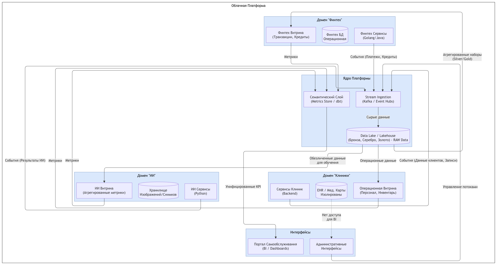

# Целевая архитектура через год (диаграмма контейнеров C4)

Ниже представлена архитектура системы через год, построенная на принципах Data Mesh и озерного хранилища (Data Lakehouse). Это обеспечивает доменную независимость, масштабируемость и быстрый доступ к данным для аналитики.

## Ключевые изменения и их связь с бизнес-сценариями

- Отказ от монолитного DWH – переход к центральному Озеру Данных (Data Lake) и доменным витринам (Data Marts). Каждое подразделение (Клиники, ИИ, Финтех) развивает свою логику независимо.
- Внедрение Semantic Layer – унифицированный слой метрик над витринами, основа для Портала самообслуживания. Позволяет быстро строить отчёты без знания структуры БД.
- Отказ от ESB (Apache Camel) в пользу Event-Driven Architecture (EDA) – интеграция через потоки событий (Kafka). Новые бизнесы подключаются подпиской на события, без изменения всей шины.
- Разделение сред и строгий контроль доступа – медицинские данные (запрещённые для аналитики) изолированы в отдельном защищённом контейнере, не попадают в витрину для аналитики.

# Проблемные места

| № | Проблемное место                              | Описание                                                                                                                                                        | Какой бизнес-сценарий страдает?                                                                            |
|---|-----------------------------------------------|-----------------------------------------------------------------------------------------------------------------------------------------------------------------|------------------------------------------------------------------------------------------------------------|
| 1 | Монолитный DWH                                | Вся логика (медицина, финансы, ИИ) сосредоточена в одном SQL Server 2008. Изменение в одном домене требует полного регрессионного тестирования всего хранилища. | Скорость выхода на рынок (Time-to-Market) новых фич. Независимость подразделений.                          |
| 2 | Устаревшая платформа (SQL 2008)               | SQL Server 2008 не поддерживает современные функции партиционирования и работы с JSON/полуструктурированными данными.                                           | Производительность (отчёты строятся часами). Затраты на поддержку (дорогой инженерный ресурс).             |
| 3 | "Толстый" клиент PowerBuilder                 | Бизнес-логика и логика отчётности жестко зашита в десктопное приложение. Обновление отчётов требует перекомпиляции и переустановки на всех рабочих станциях.    | Гибкость и скорость разработки. Реакция на изменения регулятора занимает недели.                           |
| 4 | ESB (Apache Camel) как "узкая горловина"      | Все потоки данных проходят через единую шину. При добавлении нового бизнеса или при всплеске нагрузки ESB становится бутылочным горлышком.                      | Масштабируемость и Отказоустойчивость. Риск коллапса интеграции при подключении производителя электроники. |
| 5 | Смешение операционных и аналитических данных  | Данные для отчётов берутся из тех же систем, что и транзакции. Это влияет на скорость работы врачей/операторов в пиковые часы.                                  | Качество медицинских/финансовых сервисов (медленные интерфейсы).                                           |
| 6 | Отсутствие управления качеством и метаданными | Нет каталога данных. Аналитики тратят 70% времени на поиск и очистку данных.                                                                                    | Задержки в принятии управленческих решений (неясно, каким данным верить).                                  |
| 7 | Слабая сегментация доступа                    | Медицинские данные (истории болезней) хранятся вместе с финансовыми. Высокий риск утечки чувствительных данных.                                                 | Информационная безопасность и Регуляторные риски (штрафы, потеря репутации).                               |

# Приоритизация проблем (Матрица Эйзенхауэра + MoSCoW)

## Матрица Эйзенхауэра

| Важность / Срочность                       | Срочно (нужно делать сейчас)                                                                                 | Не срочно (стратегически важно)                                                                       |
|--------------------------------------------|--------------------------------------------------------------------------------------------------------------|-------------------------------------------------------------------------------------------------------|
| Важно (критично для выручки, безопасности) | 5. Смешение данных – влияет на качество сервисов. 2. Устаревшая платформа – влияет на производительность. | 6. Управление качеством – замедляет рост. 4. ESB горловина – станет критичной при масштабировании. |
| Не важно (не критично в ближайший год)     | 3. PowerBuilder – мешает развитию, но пока терпимо.                                                          | 7. Безопасность – риск пока не реализовался. 1. Монолитность – требует долгого рефакторинга.       |

## Приоритизация в формате MoSCoW

| Категория                       | Проблема                                         | Обоснование связи с бизнес-целями                                                                                                                                                                                                                              |
|---------------------------------|--------------------------------------------------|----------------------------------------------------------------------------------------------------------------------------------------------------------------------------------------------------------------------------------------------------------------|
| Must Have (критично)            | №5: Смешение операционных и аналитических данных | Качество сервисов. Если отчётность грузит операционную БД, врачи не могут быстро открыть карту, кассиры – провести платеж. Прямая потеря выручки и ухудшение репутации.                                                                                        |
|                                 | №2: Устаревшая платформа (SQL 2008)              | Производительность и затраты. Дальнейшая работа на версии 2008 – угроза безопасности и невозможность масштабирования. Блокирует переход в облако.                                                                                                              |
| Should Have (важно, есть запас) | №3: PowerBuilder (Legacy UI)                     | Скорость выхода на рынок. Мы не можем быстро менять интерфейсы. На первом этапе оставляем для старых процессов, новые фичи делаем на Web.                                                                                                                      |
|                                 | №4: ESB как горловина                            | Масштабируемость. Пока 4 домена – терпимо. При подключении новых бизнесов ESB "ляжет". Замена на Kafka должна быть завершена до интеграции новых бизнесов.                                                                                                     |
| Could Have (можно позже)        | №1: Монолитность DWH (бизнес-логика)             | Независимость. Переписывание логики DWH – самый долгий и дорогой процесс. Делаем в последнюю очередь (Year 2), используя стратегию "Strangler Fig".                                                                                                            |
|                                 | №6: Управление метаданными                       | Удобство. Без каталога данных аналитики ещё работают. Семантический слой частично решит проблему, давая понятные KPI.                                                                                                                                          |
| Won't Have (отказ)              | №7: Строгая изоляция мед. данных (в DWH)         | Безопасность. Медицинские карты не будут перенесены в новую аналитическую систему, останутся в старом DWH или защищённом хранилище и не войдут в Витрину данных (согласно бизнес-требованию). Это снимает проблему сложного разграничения доступа к аналитике. |
