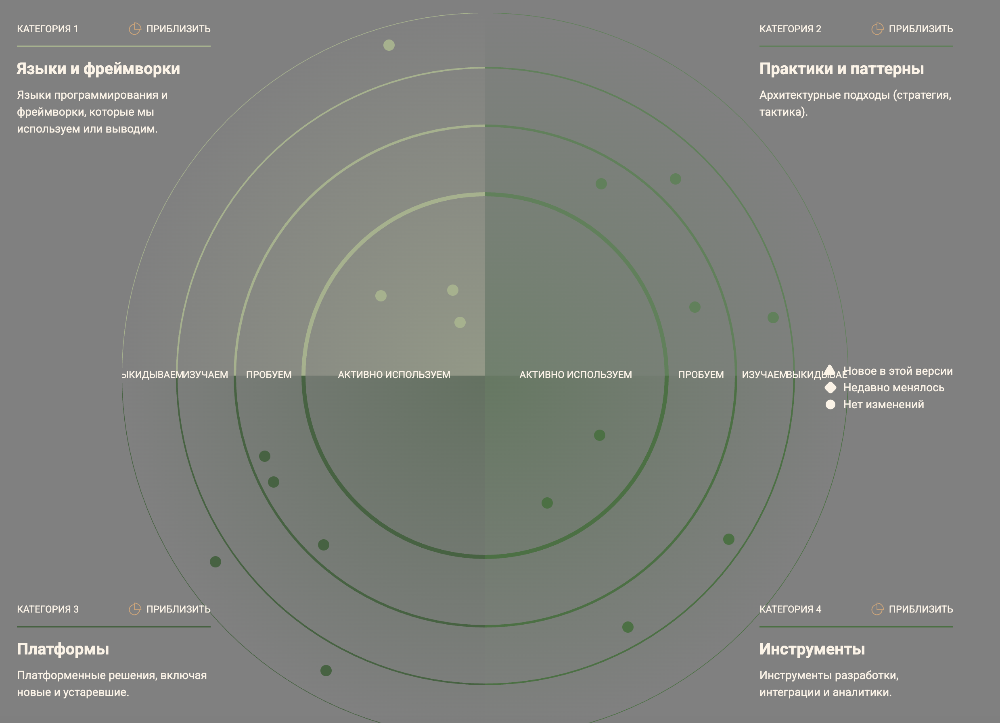
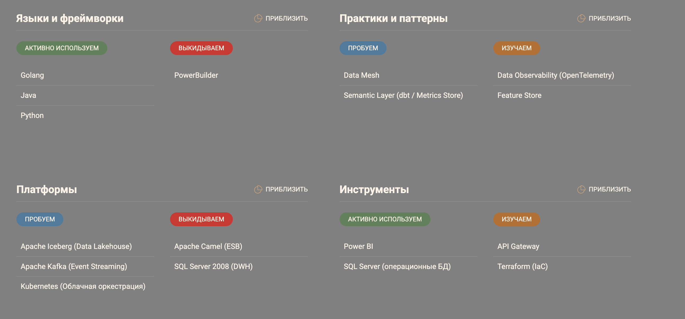
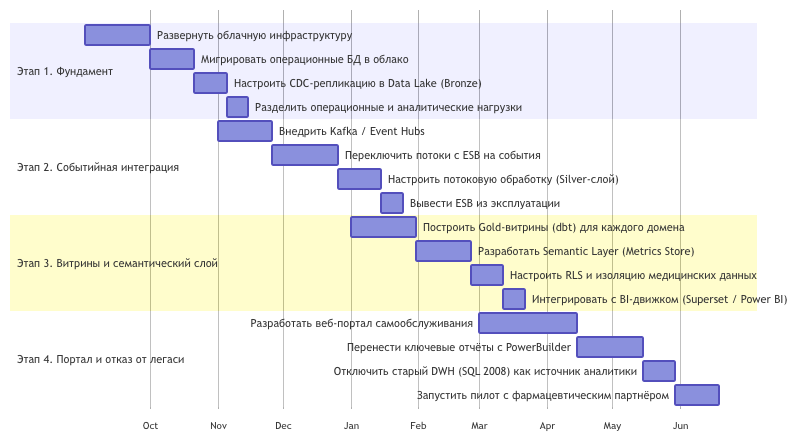

# Технологический радар

Радар разделён на четыре квадранта:
- Языки и фреймворки – языки программирования и фреймворки, которые мы используем или выводим.
- Практики и паттерны – архитектурные подходы (стратегия, тактика).
- Платформы – платформенные решения, включая новые и устаревшие.
- Инструменты – инструменты разработки, интеграции и аналитики.

Внутри каждого квадранта технологии распределены по кольцам, отражающим их жизненный цикл:
- Активно используем – проверенные решения в production.
- Пробуем – пилотируем, накапливаем опыт.
- Изучаем – проводим исследование, делаем POC.
- Выкидываем – планово выводим из эксплуатации.

# Таблица соответствия технологий и бизнес-сценариев

| Технология / Методология              | Кольцо             | Квадрант                | Поддерживаемые бизнес-сценарии                                                                                                                           |
|---------------------------------------|--------------------|-------------------------|----------------------------------------------------------------------------------------------------------------------------------------------------------|
| Data Lakehouse (Apache Iceberg)       | Пробуем            | Платформы               | Единое хранилище для всех данных. Обеспечивает быстрый доступ к агрегированным данным для отчётности и масштабирование при подключении новых бизнесов.   |
| Kafka / Event Hubs                    | Пробуем            | Платформы               | Замена ESB. Позволяет асинхронно интегрировать фарм- и электронных партнёров, не создавая узких горловин. Обеспечивает отказоустойчивость.               |
| Semantic Layer (dbt / Metrics Store)  | Пробуем            | Практики и паттерны     | Основа портала самообслуживания. Позволяет бизнес-пользователям строить отчёты по унифицированным KPI без знания SQL, сокращая время принятия решений.   |
| Data Mesh (доменная архитектура)      | Пробуем            | Практики и паттерны     | Обеспечивает независимое развитие клиник, финтеха и ИИ. Команды сами управляют своими данными, не блокируя друг друга.                                   |
| Kubernetes / Облачные сервисы         | Пробуем            | Платформы               | Обеспечивает автоматическое масштабирование ресурсов под пиковые нагрузки (например, массовые медосмотры) и снижает затраты на железо.                   |
| Data Observability                    | Изучаем            | Практики и паттерны     | Повышает качество данных. Быстрое обнаружение аномалий в данных помогает сохранить доверие к отчётам и качество медицинских/финансовых сервисов.         |
| Feature Store                         | Изучаем            | Практики и паттерны     | Ускоряет разработку ИИ-моделей, позволяя переиспользовать подготовленные признаки для новых алгоритмов.                                                  |
| API Gateway                           | Изучаем            | Инструменты             | Безопасное подключение внешних партнёров и мобильных приложений с контролем доступа и тарификацией.                                                      |
| Terraform (IaC)                       | Изучаем            | Инструменты             | Управление облачной инфраструктурой как кодом. Позволяет быстро разворачивать среды для новых бизнесов.                                                  |
| Power BI                              | Активно используем | Инструменты             | Используется как временный интерфейс для старых отчётов, пока портал самообслуживания не закроет все потребности.                                        |
| Python / Golang / Java                | Активно используем | Языки и фреймворки      | Основные языки для разработки доменных сервисов. Сохраняются для ИИ (Python) и высоконагруженных финтех-бекендов (Go/Java).                              |
| SQL Server (операционные БД)          | Активно используем | Инструменты             | Операционные базы данных клиник и финтеха. Перемещены в облако, используются для транзакционной работы.                                                  |
| SQL Server 2008 (как DWH)             | Выкидываем         | Платформы               | Выводится из эксплуатации как источник для аналитики. Мигрируем на Data Lakehouse, чтобы снять ограничения по производительности и объёму.               |
| PowerBuilder                          | Выкидываем         | Языки и фреймворки      | Заменяется веб-интерфейсами и порталом самообслуживания. Ускоряет вывод новых фич (не надо переустанавливать клиент).                                    |
| Apache Camel (ESB)                    | Выкидываем         | Платформы               | Заменяется на Kafka. Устраняет единую точку отказа и бутылочное горлышко, повышая масштабируемость интеграций.                                           |

# Роадмап изменений (на 12 месяцев)

Роадмап разбит на 4 этапа, каждый из которых решает конкретные бизнес-задачи и приближает к финальной архитектуре.

## Этап 1. Фундамент облачной платформы и разделение данных

Срок: Месяцы 1–2  
Бизнес-цель: Снижение затрат на оборудование, повышение доступности сервисов.

Действия:
1. Развернуть облачную инфраструктуру (IaaS/PaaS).
2. Мигрировать операционные БД (клиники, финтех) в облачные managed-инстансы (с сохранением версии SQL для совместимости на первом шаге).
3. Настроить репликацию (CDC) для выгрузки аналитических данных из операционных БД в сырое облачное хранилище (Bronze).
4. Разделить доступ: аналитические запросы идут к репликам, операционные — к основным БД.

Ожидаемые результаты:  
Операционные системы клиник и финтеха перестали тормозить из-за отчётов. Данные реплицируются в облако с задержкой < 5 минут.

Ответственные команды:  
Платформенная команда (DevOps + DBA) совместно с командами Клиник и Финтеха.

Необходимые ресурсы:  
Бюджет на облачные сервисы (CSP), инженеры по миграции данных.

Обоснование:  
Это критично для качества сервисов (убираем взаимовлияние транзакций и аналитики) и является базой для всех последующих шагов.

## Этап 2. Переход на событийную интеграцию (EDA)

Срок: Месяцы 3–5  
Бизнес-цель: Масштабируемость для подключения новых бизнесов и партнёров, отказ от ESB.

Действия:
1. Внедрить кластер Kafka (или управляемый Event Hubs).
2. Переключить интеграционные потоки с ESB на Kafka: домены (Клиники, Финтех, ИИ) начинают публиковать события изменений.
3. Внедрить потоковую обработку для наполнения Data Lake (Silver-слой: очищенные, проверенные данные).
4. Настроить мониторинг задержек и пропускной способности.

Ожидаемые результаты:  
ESB обесточен (выведен из эксплуатации). Время интеграции нового сервиса сокращается с 3 недель до 2 дней. Данные в озере обновляются в реальном времени.

Ответственные команды:  
Платформенная команда + команды разработки доменов (интеграция API).

Необходимые ресурсы:  
Инженеры Kafka, специалисты по потоковой обработке (Flink/Spark Streaming).

Обоснование:  
ESB — узкое место для масштабирования. Переход на EDA позволит подключить производителя электроники за недели, а не месяцы, и повысит отказоустойчивость (события буферизируются).

## Этап 3. Построение доменных витрин и семантического слоя

Срок: Месяцы 6–8  
Бизнес-цель: Ускорение подготовки отчётности (time-to-insight), обеспечение независимости доменов.

Действия:
1. На основе Silver-слоя построить Gold-витрины для каждого домена (Клиники, Финтех, ИИ) с использованием dbt.
2. Разработать семантический слой (Metrics Store) — единый словарь бизнес-показателей (Выручка, Количество пациентов, Просроченные кредиты и т.д.).
3. Настроить Row-Level Security (RLS) для разграничения доступа к данным в витринах.
4. Интегрировать семантический слой с BI-движком (например, Superset / Power BI Premium).

Ожидаемые результаты:  
Базовые отчёты строятся за 5–10 секунд (вместо часов). Бизнес-пользователи могут самостоятельно собирать дашборды. Медицинские карты (EHR) изолированы и не попали в Gold-витрины.

Ответственные команды:  
Команда Data Platform (Data Engineers + Analytics Engineers) при участии бизнес-аналитиков из каждого домена.

Необходимые ресурсы:  
Инженеры dbt, специалисты по моделированию данных, лицензии на BI-инструменты.

Обоснование:  
Это ядро скорости принятия решений. Руководство получает актуальные показатели в реальном времени, а аналитики перестают ждать выполнения тяжелых запросов к монолиту.

## Этап 4. Запуск портала самообслуживания и отказ от легаси

Срок: Месяцы 9–12  
Бизнес-цель: Полная независимость подразделений, снижение затрат на поддержку устаревших систем.

Действия:
1. Запуск веб-портала самообслуживания с интерфейсом «конструктор отчётов» на основе семантического слоя.
2. Перенос ключевых управленческих отчётов с PowerBuilder на портал.
3. Отключение старого DWH (SQL 2008) как источника данных для аналитики (перевод всех потребителей на новый портал/витрины).
4. Декомпозиция оставшихся монолитных процедур с использованием паттерна "Strangler Fig".
5. Запуск пилотного проекта по интеграции с фармацевтическим партнёром через Kafka.

Ожидаемые результаты:  
PowerBuilder используется минимально (только для критических legacy-операций до полной замены). Старый DWH выключен из аналитического контура (экономия на лицензиях и поддержке). Портал используется 80% бизнес-пользователей.

Ответственные команды:  
Все команды (UI/UX для портала, платформа для инфраструктуры, домены для миграции логики).

Необходимые ресурсы:  
Frontend-разработчики, тестировщики, бюджет на обучение пользователей.

Обоснование:  
Это финальный шаг к независимости развития. Вывод PowerBuilder и старого SQL-сервера снижает операционные затраты (OPEX) на 30–40% и убирает технический долг, блокирующий использование современных алгоритмов (например, работа с JSON в ИИ).