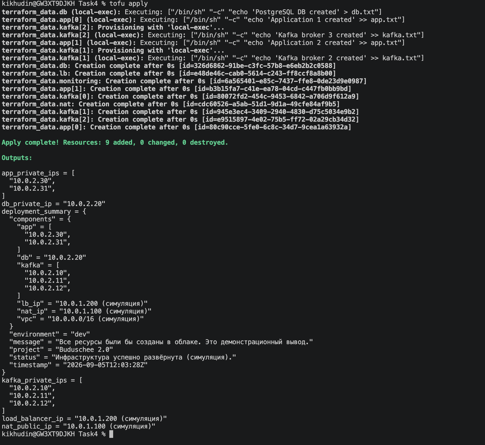

# Обоснование конфигурации инфраструктуры (OpenTofu)

## Выбор инструмента: OpenTofu вместо Terraform

В качестве основного инструмента для управления инфраструктурой как кодом (IaC) выбран OpenTofu — открытый форк Terraform, поддерживаемый сообществом. Это решение обусловлено:

- Полной совместимостью с существующими конфигурациями (файлы `.tf`, провайдеры, синтаксис HCL).
- Независимостью от лицензионных ограничений HashiCorp.
- Возможностью использования без внешнего реестра – встроенные ресурсы OpenTofu позволяют выполнять локальные действия без загрузки провайдеров.

Все команды в проекте выполняются с префиксом `tofu` вместо `terraform` (например, `tofu init`, `tofu plan`, `tofu apply`).

## Причина выбора локальной симуляции вместо облачного развёртывания

В рамках выполнения задания «Проектирование облачной инфраструктуры с применением IaaS и Terraform» требовалось подготовить Terraform-конфигурацию и продемонстрировать её работу. В реальных условиях компания «Будущее 2.0» планирует использовать Yandex Cloud с учётом российских регуляторных требований. Однако в учебной среде мы столкнулись с ограничениями:

- Недоступность официального реестра провайдеров (`registry.terraform.io`) из региона.
- Отсутствие возможности создать реальную инфраструктуру в облаке без оплачиваемого аккаунта.

В связи с этим было принято решение разработать локальную симуляцию, которая повторяет логику развёртывания, но использует встроенный ресурс `terraform_data` и локальные `provisioner` вместо обращения к облачному API. Это позволяет:

- Выполнить все ключевые команды (`init`, `plan`, `apply`) без внешних зависимостей.
- Продемонстрировать понимание декларативного подхода и структуры IaC-проекта.
- Получить визуальное подтверждение (скриншот) для отчёта, не тратя ресурсы облака.

При этом конфигурация спроектирована так, что её легко адаптировать для реального облака: достаточно заменить ресурсы `terraform_data` на соответствующие ресурсы провайдера `yandex-cloud/yandex` и добавить необходимые переменные аутентификации.

## Выбор ресурсов

### Виртуальные машины (ВМ)
- NAT-инстанс: 2 vCPU, 2 GB RAM – минимальная конфигурация, достаточная для маршрутизации трафика.
- Kafka брокеры: 4 vCPU, 8 GB RAM – для обеспечения высокой пропускной способности потоковой передачи.
- База данных: 4 vCPU, 16 GB RAM, диск 200 GB – типичные требования для PostgreSQL с учётом нагрузки.
- Приложения: 2 vCPU, 4 GB RAM – стандартный размер для микросервисов, может масштабироваться горизонтально.
- Мониторинг: 2 vCPU, 4 GB RAM – для сбора метрик и визуализации.

### Диски
- Используются `network-hdd` – баланс между стоимостью и производительностью. Для Kafka и БД предусмотрены отдельные диски, чтобы избежать конкуренции за ввод-вывод с системным диском.

### Сеть
- VPC с подсетями public/private – изоляция внутренних сервисов от прямого доступа из интернета.
- NAT – позволяет ВМ в приватной подсети обновлять пакеты и подключаться к внешним репозиториям.
- Группы безопасности – ограничивают доступ только по необходимым портам (SSH, внутренние порты приложений, Kafka).
- Балансировщик нагрузки – распределяет трафик между приложениями, повышая отказоустойчивость.

## Структура конфигурации и симулируемые компоненты

Конфигурация повторяет архитектуру, описанную в задании, и включает симуляцию следующих компонентов:

| Компонент                | Симуляция                                                 | Соответствие реальной инфраструктуре                   |
|--------------------------|-----------------------------------------------------------|--------------------------------------------------------|
| VPC                      | Не создаётся, но указан в outputs как `10.0.0.0/16`       | Был бы создан ресурс `yandex_vpc_network`              |
| Публичная подсеть        | Не создаётся, но указан CIDR `10.0.1.0/24`                | Был бы создан ресурс `yandex_vpc_subnet`               |
| Приватная подсеть        | Не создаётся, но указан CIDR `10.0.2.0/24`                | Был бы создан ресурс `yandex_vpc_subnet`               |
| NAT-инстанс              | `terraform_data.nat` создаёт файл `nat.txt`               | Был бы создан `yandex_compute_instance` с публичным IP |
| Kafka брокеры (3 шт.)    | `terraform_data.kafka` создаёт файл `kafka.txt`           | Были бы созданы 3 ВМ с дисками                         |
| База данных PostgreSQL   | `terraform_data.db` создаёт файл `db.txt`                 | Была бы создана ВМ с отдельным диском                  |
| Приложения (2 шт.)       | `terraform_data.app` создаёт файл `app.txt`               | Были бы созданы 2 ВМ для микросервисов                 |
| Мониторинг               | `terraform_data.monitoring` создаёт файл `monitoring.txt` | Была бы создана ВМ для Prometheus/Grafana              |
| Балансировщик            | `terraform_data.lb` создаёт файл `lb.txt`                 | Был бы создан `yandex_lb_network_load_balancer`        |

Все выходные параметры (`outputs`) содержат симулированные IP-адреса и структуру, полностью соответствующую реальной архитектуре.

## Использование декларативного подхода (IaC)

Конфигурация написана в декларативном стиле, что обеспечивает:

- Воспроизводимость – при каждом запуске создаются одинаковые файлы-маркеры.
- Версионирование – изменения вносятся через код и могут быть сохранены в системе контроля версий.
- Автоматизацию – развёртывание выполняется одной командой `tofu apply`.
- Масштабируемость – количество Kafka брокеров и приложений легко меняется через переменные.

Это демонстрирует ключевые преимущества подхода Infrastructure as Code, которые в реальном проекте позволят быстро разворачивать окружения и управлять ими.


## Как запустить и проверить

1. Установите OpenTofu (например, через `brew install opentofu`).
2. Перейдите в папку `Task4`.
3. Выполните:
   ```bash
   tofu init
   tofu plan
   tofu apply -auto-approve
   
